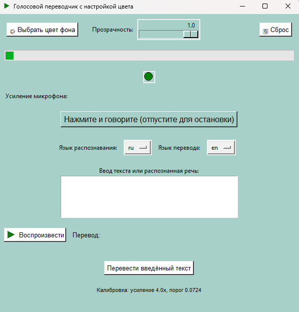
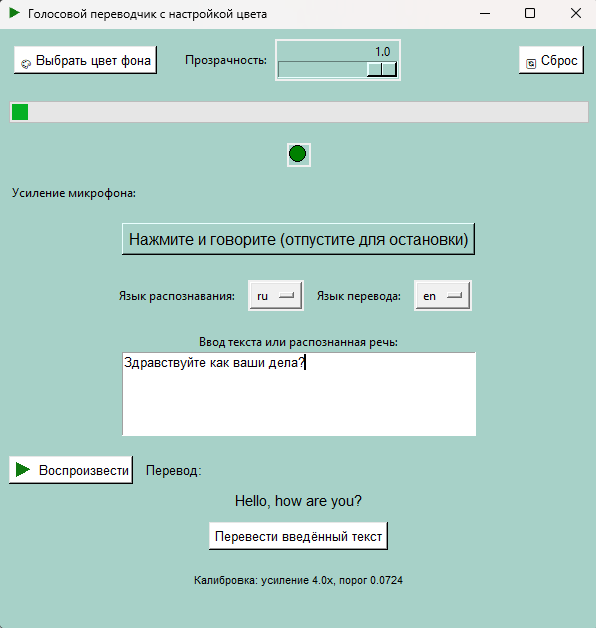

# 🎤 VoiceTranslator - Голосовой Переводчик




**Многоязычный голосовой переводчик** с распознаванием речи и синтезом голоса. Поддерживает русский, английский, французский и китайский языки.

## 🌟 Особенности

- 🎤 **Распознавание речи** с помощью Vosk моделей
- 🔄 **Перевод между языками** через Argos Translate
- 🔊 **Синтез речи** с поддержкой разных языков
- 🎨 **Настраиваемый интерфейс** с выбором цвета и прозрачности
- ⌨️ **Горячие клавиши** для быстрого доступа
- 🎚️ **Калибровка микрофона** с автоматическим подбором параметров
- 📱 **Готовый EXE** для Windows

## 🗣️ Поддерживаемые языки

| Язык | Код | Распознавание | Перевод | Озвучка |
|------|-----|---------------|---------|----------|
| Русский | `ru` | ✅ | ✅ | ✅ |
| Английский | `en` | ✅ | ✅ | ✅ |
| Французский | `fr` | ✅ | ✅ | ✅ |
| Китайский | `zh` | ✅ | ✅ | ✅ |

## 🚀 Быстрый старт

### Скачивание готовой версии

1. **Скачайте последний релиз** с [Releases](https://github.com/Kosmonaffter/VoiceTranslator/releases)
2. **Скачайте модели распознавания речи**:
   - [Английская модель](https://alphacephei.com/vosk/models/vosk-model-small-en-us-0.15.zip) → распаковать в `model_en/`
   - [Русская модель](https://alphacephei.com/vosk/models/vosk-model-small-ru-0.22.zip) → распаковать в `model_ru/`
   - [Французская модель](https://alphacephei.com/vosk/models/vosk-model-small-fr-0.22.zip) → распаковать в `model_fr/`
   - [Китайская модель](https://alphacephei.com/vosk/models/vosk-model-small-cn-0.22.zip) → распаковать в `model_zh/`

3. **Запустите** `VoiceTranslator.exe`

### Установка для разработки

```bash
# Клонирование репозитория
git clone https://github.com/Kosmonaffter/VoiceTranslator.git
cd VoiceTranslator

# Создание виртуального окружения
python -m venv venv
venv\Scripts\activate  # Windows

# Установка зависимостей
pip install -r requirements.txt

# Скачивание моделей (см. выше)
# Запуск приложения
python start.py
```


🎯 Использование
##Основные функции

Выберите языки:
Язык распознавания (исходный)
Язык перевода (целевой)

Запись голоса:
Нажмите кнопку "Нажмите и говорите"
Или используйте горячую клавишу Left Alt
Отпустите для остановки записи

Результат:
Текст отображается в поле ввода
Перевод показывается ниже
Автоматическое озвучивание перевода

Дополнительные функции:
Ручной ввод текста для перевода
Повторное воспроизведение последнего перевода
Настройка усиления микрофона

Настройки интерфейса
🎨 Выбор цвета фона - кнопка "Выбрать цвет фона"
⚫ Прозрачность окна - регулируется слайдером
🔄 Сброс настроек - кнопка "Сброс"

🛠️ Технические детали
Архитектура приложения
```text
VoiceTranslator/
├── 🎤 audio_utils.py      # Работа с аудио и микрофоном
├── 🔄 translation.py      # Перевод и распознавание речи
├── 🎨 start.py           # Графический интерфейс
├── 📊 utils.py           # Вспомогательные функции
├── 📝 logger_setup.py    # Настройка логирования
├── 🏗️ code.py            # Утилиты для PyInstaller
└── 📦 requirements.txt   # Зависимости Python
```
Ключевые технологии
Vosk - распознавание речи с offline-моделями
Argos Translate - машинный перевод
PyAudio/sounddevice - работа с аудио
pyttsx3 - синтез речи
Tkinter - графический интерфейс
PyInstaller - создание исполняемого файла

Модели распознавания
Приложение использует small-модели Vosk (~40-50MB каждая):
vosk-model-small-en-us-0.15 - английский
vosk-model-small-ru-0.22 - русский
vosk-model-small-fr-0.22 - французский
vosk-model-small-cn-0.22 - китайский

⚙️ Настройка и калибровка
Калибровка микрофона
При первом запуске приложение автоматически:

Тестирует доступные микрофоны
Определяет фоновый шум
Подбирает оптимальное усиление
Устанавливает порог тишины
Ручная настройка через слайдер "Усиление микрофона".

Решение проблем
Проблема: "Не найден микрофон"

```bash
# Проверка устройств в Python
import sounddevice as sd
print(sd.query_devices())
```
Проблема: "Модель не загружена"
Убедитесь, что модели скачаны в правильные папки

Проверьте структуру: model_ru/vosk-model-small-ru-0.22/

Проблема: "Нет озвучки"
Проверьте системные голоса в настройках Windows

Для китайского языка может потребоваться установка дополнительных голосов

🎨 Кастомизация
Изменение цветовой схемы

```python
# В app_config.json
{
    "bg_color": "#FFC0CB",  # Розовый фон
    "window_alpha": 0.9,    # Прозрачность
    "input_lang": "ru",     # Язык по умолчанию
    "output_lang": "en",    # Язык перевода по умолчанию
    "amplification": 2.0    # Усиление микрофона
}
```
Добавление новых языков
Скачайте модель Vosk для нужного языка

Добавьте в models_paths в start.py:

```python
models_paths = {
    "en": get_model_path("model_en/vosk-model-small-en-us-0.15"),
    "fr": get_model_path("model_fr/vosk-model-small-fr-0.22"),
    # Добавьте новый язык
    "es": get_model_path("model_es/vosk-model-small-es-0.22"),
}
Обновите список языков в интерфейсе

📦 Сборка EXE
```bash
# Установка PyInstaller
pip install pyinstaller

# Сборка исполняемого файла
pyinstaller --onefile --windowed --icon=icons/icq_transl.ico --add-data="icons;icons" --add-data="model_en;model_en" --add-data="model_ru;model_ru" --add-data="model_fr;model_fr" --add-data="model_zh;model_zh" start.py
```

🐛 Известные ограничения
Требуются модели Vosk (~200MB всего) - скачиваются отдельно
Качество перевода зависит от Argos Translate
Озвучка китайского требует настроенных системных голосов в Windows
Только Windows - из-за зависимостей от pyttsx3 и comtypes

🤝 Разработка
Структура проекта

VoiceTranslator/
├── 📁 icons/              # Иконки приложения
│   ├── icq_transl.ico
│   └── PLAY.png
├── 📁 model_en/           # Модель английского
├── 📁 model_ru/           # Модель русского
├── 📁 model_fr/           # Модель французского
├── 📁 model_zh/           # Модель китайского
├── 📁 venv/               # Виртуальное окружение
├── 🎤 audio_utils.py      # Утилиты аудио
├── 🔄 translation.py      # Переводчик
├── 🎨 start.py           # GUI приложение
├── 📝 logger_setup.py    # Логирование
├── 📦 requirements.txt   # Зависимости
└── 🏗️ code.py            # Вспомогательные функции

Зависимости
Основные зависимости:
vosk - распознавание речи
argostranslate - машинный перевод
sounddevice, pyaudio - работа с аудио
pyttsx3 - синтез речи
keyboard - обработка горячих клавиш
tkinter - графический интерфейс

📄 Лицензия
MIT License

👨‍💻 Автор
Юрий Атласюк
Telegram: @kosmonafftsb
Email: kosmonaffter@yandex.ru
Год: 2025

⭐ Если проект был полезен, поставьте звезду на GitHub! ⭐